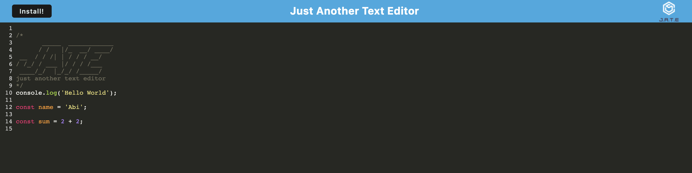

# Text Editor

## Description
    
A PWA Application that allows you to create notes or code snippets with or without an internet connection.

Visit the website: https://peaceful-headland-90409.herokuapp.com/

## Table of Contents
    
- [Usage](#usage)
- [Contribute](#contribute)
- [Questions](#questions)

## Usage
    
Simply write your notes/code and note how after you either click off the window or go to a different window, your code will still be there after you refresh the page or after you close it and open it again. You can also click on the install button in order to install Text Editor as an icon on your desktop.

## Contribute
    
If you would like to contribute to this project, feel free to make a pull request.
    
## Questions

If you have any questions, open an issue or contact me directly at abimael.monarrez58@gmail.com. You can find more of my work at [Abimael1996](https://github.com/Abimael1996).

